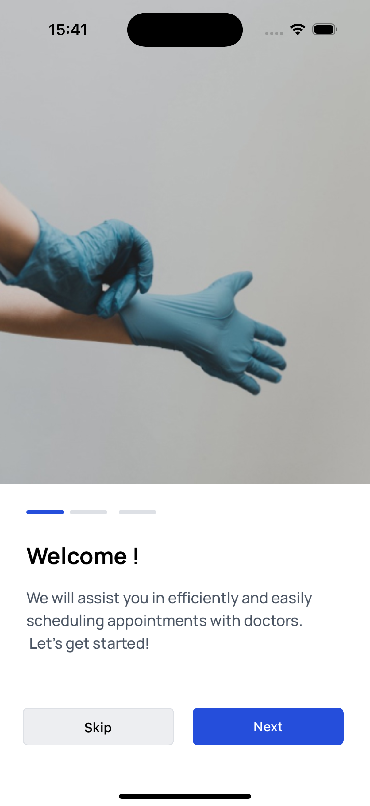

# Invitro App

**Version:** 1.0.0

## Description

Invitro App is an innovative mobile application designed to enhance user engagement and streamline the experience of discovering and managing health-related information. Built with **React Native** and **Expo**, this app provides a modern interface with a focus on usability and aesthetics. It leverages **Material Tailwind** for a clean and responsive design and incorporates **Google Sign-In** for a secure and hassle-free authentication process.

Key functionalities include user onboarding, intuitive navigation, and seamless integration with RESTful APIs to fetch data dynamically. The app's architecture allows for easy scalability and maintenance, making it suitable for future enhancements.

## Features

- **User Authentication:** Securely sign in using Google accounts.
- **Responsive Design:** A fully responsive layout optimized for both Android and iOS platforms.
- **API Integration:** Efficient data fetching using Axios for a smooth user experience.
- **Onboarding Screens:** Welcoming users with guided onboarding to enhance navigation.
- **Material Design Components:** Utilizes React Native Paper for a visually appealing UI.





## Technologies Used

- **Frontend:**

  - React Native
  - Expo
  - Material Tailwind
  - React Native Paper
  - Axios (for API calls)
  - React Native Onboarding Swiper (for onboarding screens)
- **Backend:**

  - Node.js (for server-side development)
  - Mongoose (for MongoDB integration)
- **Development Utilities:**

  - Nodemon (for auto-restarting the server during development)
  - Bcryptjs (for secure password hashing)
  - React Native Dotenv (for managing environment variables)
- **Styling:**

  - Tailwind CSS (for utility-first styling)

## Installation

### Prerequisites

Before you begin, ensure you have the following installed on your machine:

- **Node.js:** Download and install it from [Node.js official website](https://nodejs.org/).
- **Expo CLI:** Install it globally using the command:

  ```bash
  npm install -g expo-cli
  ```

### Clone the Repository

To get started, clone this repository to your local machine:

```bash
git clone https://github.com/httpcatalin/Invitro-App.git
cd invitro-app
```

### Install Dependencies

Next, install the required dependencies for the project:

- Using npm:

  ```bash
  npm install
  ```
- Using yarn:

  ```
  yarn install
  ```

# Invitro App Instructions

## Environment Variables

Create a `.env.local` file in the root directory containing the following:

```bash
MONGODB_URI=your_mongodb_uri
API_URL=your_api_url
```

Make sure to replace `your_mongodb_uri` and `your_api_url` with your actual MongoDB connection string and API endpoint.

## Running the App

You can run the app on your preferred platform using the following commands:

For Android:

```bash
npx expo start --android
```

For iOS:

```bash
npx expo start --ios
```

For Development Server:

```bash
npx run nodemon
```

## Contributing

We welcome contributions to the Invitro App! If you have suggestions for improvements or new features, feel free to open an issue or submit a pull request.

## Acknowledgments

Thanks to all the open-source libraries and communities that made this project possible.
